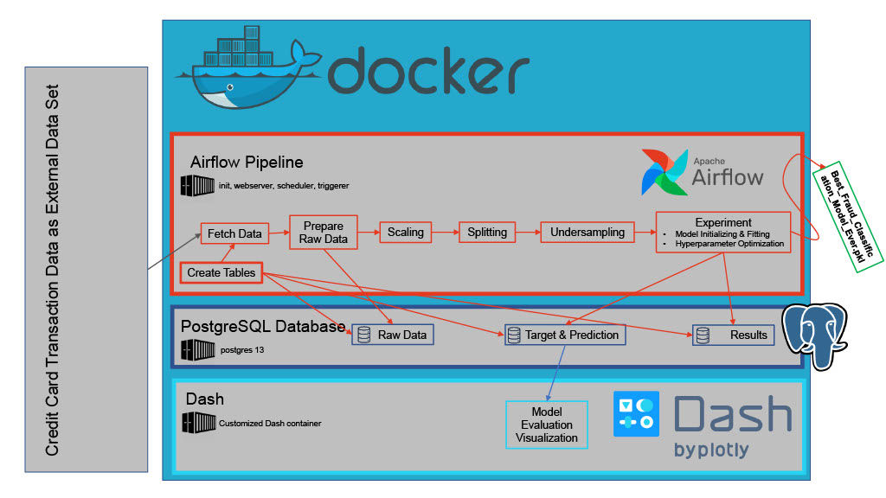
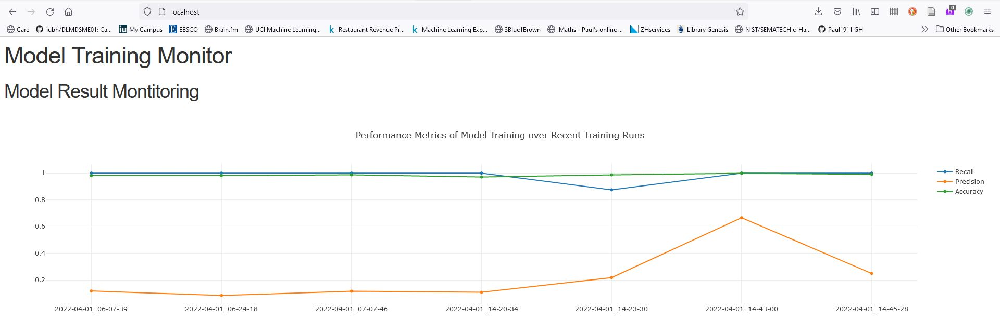

# Data Engineering Project 

In this project, I developed a reliable, scalable and maintainable batch-processing data system, focussing on the data engineering architecture and setup. It uses Airflow to orchestrate a machine learning pipeline, which is executed automatically once a day, training, evaluating, fitting and outputting the best model it computes for detecting [fradulent credit card transactions](https://www.kaggle.com/mlg-ulb/creditcardfraud) within today's batch of data.
For traceablitiy, the data of every run is persistently saved in a PostgreSQL database.  
To assess the performance of today's model, the evaluation criteria are visualized over time using Dash. To ensure a clean environment and reproducibility, the project is set up using Docker container. 

(It should be noted that the model itself is not completely optimized as the focus of this project is data engineering. Accuracy is just added for aesthetic reasons, its meaning is limited with such inbalanced dataset)

To reproduce this project, follow these simple steps:

1. Have Docker installed on your system  
2. Navigate to the folder of this readme in your terminal   
3. Initialize Airflow with the command "docker compose up airflow-init"  
4. Once the initialization has fininished, enter "docker compose up" to actually start the project  
5. Wait until all services except the Dash container are healthy - check with the command "docker ps" (Dash cannot be healthy at first startup as it does not find any data in the database)  
6. Enter "localhost:8080" in your preferred browser (like you would enter a website) to open the Airflow GUI  
7. Enter "airflow" as username and password  
8. Go to Admin --> Connections --> Add a new record and enter the following:    
  Connection Id = postgres_default  
  Connection Type = Postgres  
  Host = postgres  
  Schema = airflow  
  Login = airflow  
  Password = airflow  
  Then save connection
9. Once this is done, you can go to DAGs, select ml_pipeline and then start the process on the top right. 
Make sure to have at least 4GB of RAM available. If a task fails with return code Negsignal.SIGKILL, it is due to too little RAM available.  
10. To view the performance of the model, go to localhost:80, which is the port Dash is mapped to. 

The final models are outputted in /models, /data includes the datasets of the latest run as .csv. /dags/ml_pipeline.py is the file which creates the directed acyclic graph for Airflow while /dags/helpfiles includes all pipeline steps used in ml_pipeline.py. /app_dash contains all relevant data regarding the Dash visualization. 

Airflow's webserver offers many possibilities of tracking your pipeline performance and status, check out the graph or Gantt chart!

